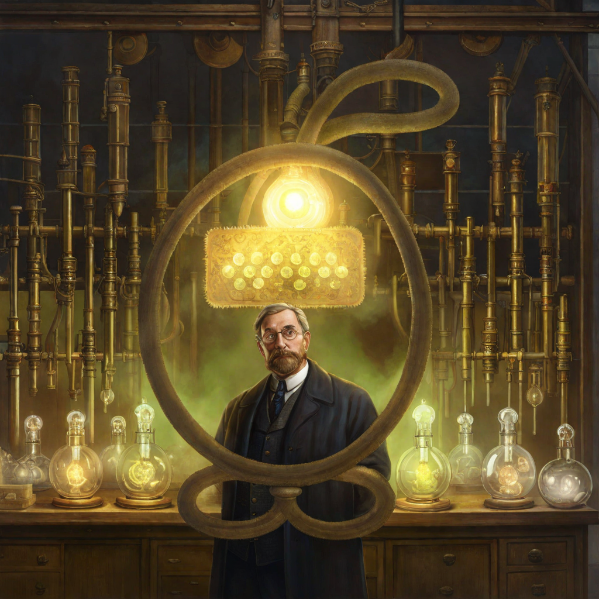
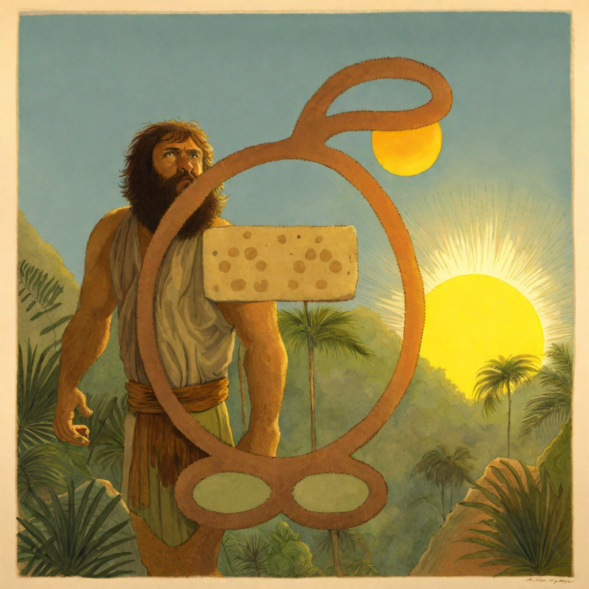

## AI-Generated Artwork

This repository contains a collection of unique artwork generated by advanced AI algorithms. Each piece in the 'AI_generated' folder is generated using a ComfyUI workflow based on mostly SDXL and a controlnet for alignment to the ELAS logo.

Below is a showcase of the artwork available in this repository:

### PNG/elas_jungle.png

### PNG/elas_hospital.png

### PNG/elas_dog.png

### PNG/elas_steam.png

### PNG/elas_owl.png

### PNG/elas_oldschool.png

### PNG/elas_drawn.png

### PNG/elas_research.png

### PNG/elas_bubble.png

### PNG/elas_sky.png

### PNG/elas_ice.png

### PNG/elas_marble.png

