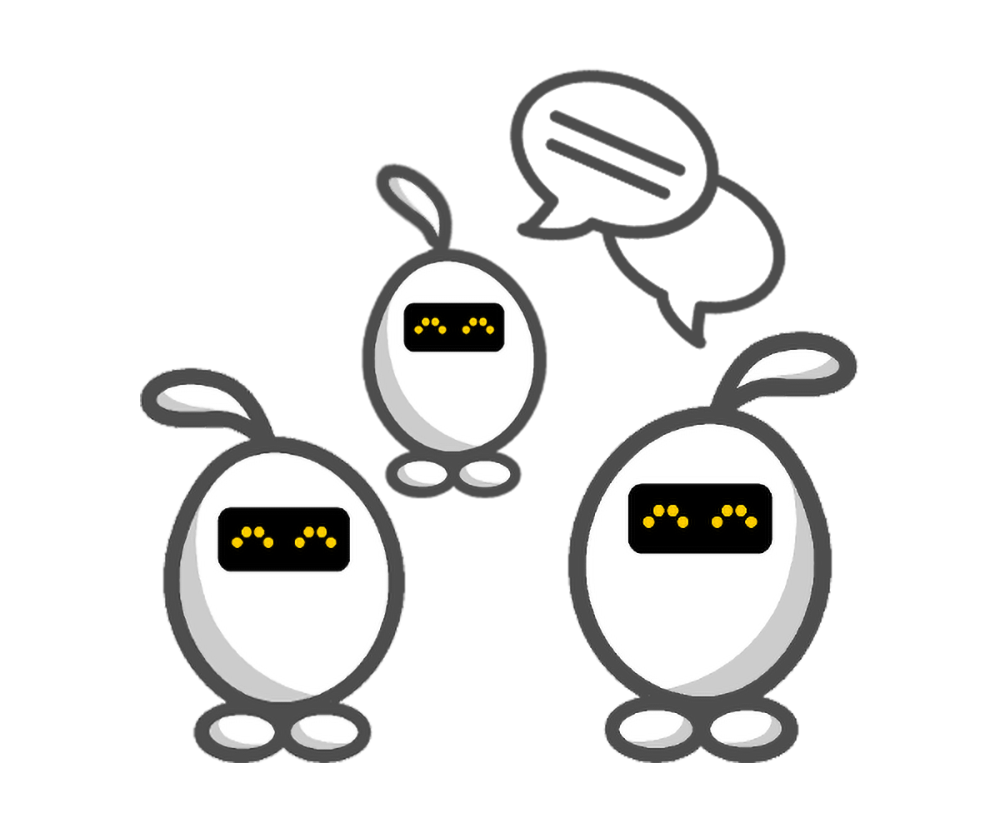

# Elas Adventures

| Elas | Art-work | | |
|---|---|---|---|
| Academy || | |
| Tennis || | |
| Tron || | |
| Tron Orange || | |
| Rugby || | |
| SuperHero || | |
| Turtle || | |
| Arrows  ||||
| Balloons || | |
| ChemistryLab || | |
| ConstructionWorker || | |
| ElasDark || | |
| ElasDataScience || | |
| ElasPad || | |
| ElasPotter || | |
| FireMan || | |
| Panda || | |
| Winter || | |
| Santa || | |
| SpecialEditions || |  |
| HoldingSIGNS || | |
| HoldingSIGNS || | |
| HoldingSIGNS || | |
| HackathonLogos |  |  |  |
|HackathonLogos |   |   |  |
| OrderingPapers | | | |
| tv || | |
| Community || | |
| Welcome&Finished || | |
