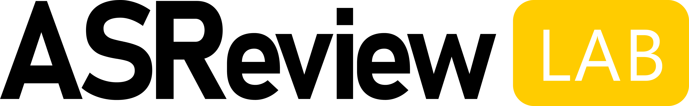

# ASReview artwork

This repository contains the artwork for the [ASReview](https://github.com/asreview/asreview/) 
project. The artwork and logos were made by [Joukje Willemsen](https://joukjewillemsen.github.io/). The work is licensed under Creative Commons License (CC BY-NC-ND 4.0).

* The folder **ElasAdventures** contains vectorart of Elas on different adventures, for example:

* The folder **Illustrations** contains Illustrations that illustrate the workflow of systematic reviews with and without the use of ASReview. For example

* The folder **LogoASReview** contains raw and compiled files of our logo:

* The folder **LogoASReviewLAB** contains raw and compiled files of the ASReviewLAB logo:

* The folder **SVGicons** contains svg's that are used in the app

