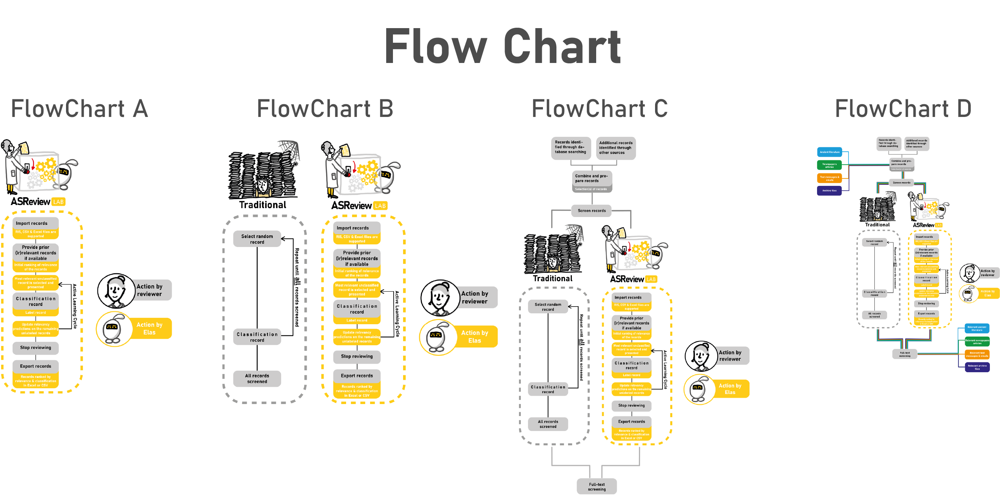
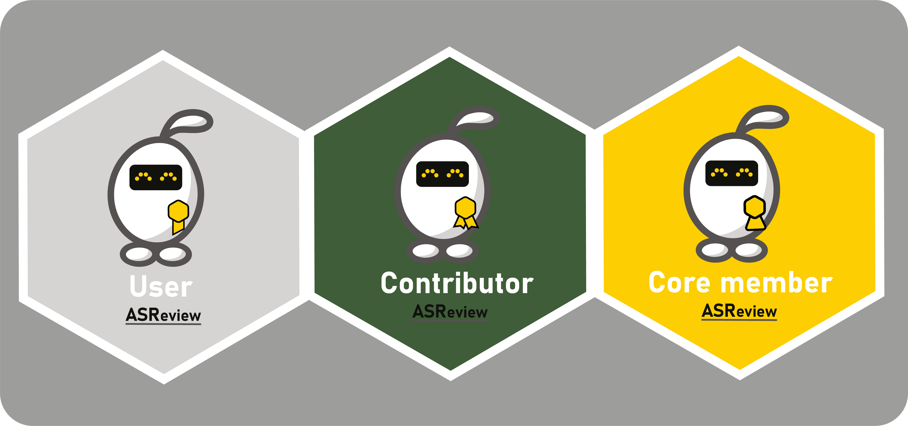

# ASReview artwork

This repository contains the artwork for the [ASReview](https://github.com/asreview/asreview/) 
project. The artwork and logos were made by [Joukje Willemsen](https://joukjewillemsen.github.io/). The work is licensed under Creative Commons License (CC BY-NC-ND 4.0).

* The folder **ElasAdventures** contains vectorart of Elas on different adventures:

* The folder **FlowChart** contains the vectorart illustrating the ASReview LAB flow, how it compares with a traditional screening process, how they fit into the systematic review process and other potential uses of ASReview LAB.

* The folder **Illustrations** contains Illustrations that illustrate the workflow of systematic reviews with and without the use of ASReview.

* The folder **LogoASReview** contains raw and compiled files of our logo:

* The folder **LogoASReviewLAB** contains raw and compiled files of the ASReviewLAB logo:

* The folder **LottieAnimation** contains animated json files created with [Lottie](https://github.com/airbnb/lottie-web) 

* The folder **QuickTour** contains the artwork used in the quicktour

* The folder **Stickers** contains AI files of stickers that were designed a while back (hence a little outdated)

* The folder **SVGicons** contains svg's that can be used on the website or in the app

