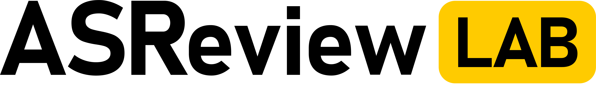

# ASReview Sublogo's

| Logo       | Art-work                                                           |
|------------|--------------------------------------------------------------------|
| Lab        |                   |
| Research   |     |
| Academy    |   |
| Datasets   |  |
| Datatools  | |
| Extensions ||
| Insights   |  |
| Lab        |       |
| Makita     |    |
| Science    |   |
| Templates  | |
| Wordcloud  | |
| Hyperopt   | |